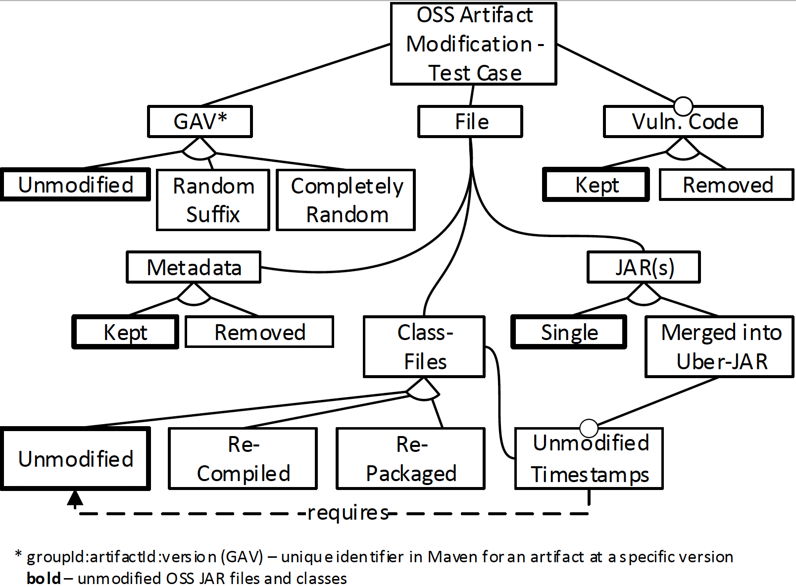

# Achilles - Test Suite for assessing OSS-Vulnerability Scanners

Achilles is an open test suite for evaluating the performance of open-source vulnerability scanners specifically for *Java* and *Maven* applications. 

Achilles was created by Andreas Dann (1), Henrik Plate (2), Ben Hermann (3), Serena Elisa (2) Ponta,  and Eric Bodden (1) of the security research group at Paderborn University (1),  SAP Security Research Mougins, France (2), and the secure software engineering group at Technical University Dortmund (3).

## Achilles is the right benchmark for you, if you are
* Using open-source libraries and frameworks,
* Using the build-automation system *Maven* to manage project dependencies,
* Worried about (potential) vulnerabilities in the libraries you use,
* Comparing the performance of depenendy scanners,
* Deciding what tools to use for checking your open-source libraries for vulnerabilities,

## What is included

### Test Cases

The folder `detection` contains 2505 test fixtures to measure the performance of open-source vulnerability scanner for detecting the inclusion of known vulnerable dependencies.
The test fixtures are in the form of json files following the naming scheme: `<CVE>_<GAV>.json.`.

The test fixtures contain true and false positive warnings raised by the tools [Eclipse Steady](https://github.com/eclipse/steady), [OWASP Dependency-Check](https://github.com/jeremylong/DependencyCheck), and a commercial open-source dependency vulnerability scanner.

#### Stats
The test cases cover *251* distinct CVEs, and *534* distinct 

An overview of the included artifacts is given in the table below

|  GroupId:ArtifactId                                            | #Num|
|:---------------------------------------------------------------|----:|
| ('axis', 'axis')                                               |   3 |
| ('bouncycastle', 'bcprov-jdk14')                               |  13 |
| ('com.fasterxml.jackson.core', 'jackson-databind')             | 606 |
| ('com.fasterxml.jackson.dataformat', 'jackson-dataformat-xml') |  77 |
| ('com.google.guava', 'guava')                                  |  25 |
| ('com.google.guava', 'guava-bootstrap')                        |   2 |
| ('com.google.protobuf', 'protobuf-java')                       |   1 |
| ('com.itextpdf', 'itextpdf')                                   |   1 |
| ('com.squareup.okhttp', 'okhttp')                              |   2 |
| ('commons-beanutils', 'commons-beanutils')                     |   6 |
| ('commons-collections', 'commons-collections')                 |  11 |
| ('commons-fileupload', 'commons-fileupload')                   |  10 |
| ('commons-httpclient', 'commons-httpclient')                   |   1 |
| ('dom4j', 'dom4j')                                             |   1 |
| ('io.netty', 'netty-all')                                      |  12 |
| ('io.undertow', 'undertow-core')                               |   9 |
| ('jasperreports', 'jasperreports')                             |   4 |
| ('javax.el', 'el-api')                                         |   1 |
| ('javax.el', 'javax.el-api')                                   |   2 |
| ('javax.faces', 'javax.faces-api')                             |   2 |
| ('javax.servlet.jsp', 'jsp-api')                               |   1 |
| ('net.sf.jasperreports', 'jasperreports')                      |  14 |
| ('ognl', 'ognl')                                               |   1 |
| ('org.apache.axis', 'axis-saaj')                               |   3 |
| ('org.apache.commons', 'commons-compress')                     |   1 |
| ('org.apache.httpcomponents', 'httpasyncclient')               |   1 |
| ('org.apache.httpcomponents', 'httpclient')                    |  32 |
| ('org.apache.lucene', 'lucene-queryparser')                    |   1 |
| ('org.apache.poi', 'poi')                                      |  37 |
| ('org.apache.poi', 'poi-ooxml')                                |   3 |
| ('org.apache.tomcat.embed', 'tomcat-embed-core')               |  29 |
| ('org.beanshell', 'bsh')                                       |   2 |
| ('org.bouncycastle', 'bcprov-jdk14')                           |   5 |
| ('org.bouncycastle', 'bcprov-jdk15on')                         |   3 |
| ('org.codehaus.castor', 'castor')                              |   1 |
| ('org.codehaus.groovy', 'groovy')                              |   2 |
| ('org.codehaus.groovy', 'groovy-all')                          |  17 |
| ('org.codehaus.groovy', 'groovy-xml')                          |   1 |
| ('org.eclipse.jetty', 'jetty-http')                            |  97 |
| ('org.eclipse.jetty', 'jetty-security')                        |  15 |
| ('org.eclipse.jetty', 'jetty-server')                          |  71 |
| ('org.eclipse.jetty', 'jetty-servlet')                         |  19 |
| ('org.eclipse.jetty', 'jetty-util')                            |  38 |
| ('org.hibernate', 'com.springsource.org.hibernate.validator')  |   2 |
| ('org.hibernate', 'hibernate-validator')                       |   7 |
| ('org.jruby', 'jruby')                                         |   9 |
| ('org.jruby', 'jruby-core')                                    |  11 |
| ('org.jruby', 'openssl')                                       |  94 |
| ('org.jruby', 'readline')                                      |   3 |
| ('org.jruby', 'ripper')                                        |  11 |
| ('org.jruby', 'yecht')                                         |   6 |
| ('org.jruby.ext.posix', 'jnr-posix')                           |   3 |
| ('org.jruby.extras', 'bytelist')                               |  12 |
| ('org.jruby.extras', 'jffi')                                   |   3 |
| ('org.jruby.util', 'bytelist')                                 |   3 |
| ('org.jsoup', 'jsoup')                                         |   1 |
| ('org.slf4j', 'slf4j-api')                                     |   1 |
| ('org.springframework', 'spring-asm')                          |  62 |
| ('org.springframework', 'spring-core')                         | 413 |
| ('org.springframework', 'spring-expression')                   |  92 |
| ('org.springframework', 'spring-jcl')                          |  36 |
| ('org.springframework', 'spring-oxm')                          |  27 |
| ('org.springframework', 'spring-tx')                           |   1 |
| ('org.springframework', 'spring-web')                          | 104 |
| ('org.springframework', 'spring-webmvc')                       |  33 |
| ('p2.eclipse-plugin', 'org.apache.axis')                       |   1 |
| ('rubygems', 'jruby-openssl')                                  | 438 |
| ('stax', 'stax')                                               |   1 |
| ('taglibs', 'standard')                                        |   1 |

### Test Generator
The generator creates, based on the test fixtures, Maven/Java projects that can be used as an input for open-source vulnerability scanner.
Each test fixtures specifies in the element `vulnerable` if the warnings is a true or false positive.

  

## Publications 

If you want to read the details on how Achilles works, and the basis on which the test suite was created, our IEEE TSE paper [Identifying Challenges for OSS Vulnerability Scanners - A Study & Test Suite
](https://ieeexplore.ieee.org/document/9506931) is a good place to start.

## We welcome your contributions!
You are most welcome to contribute additional test cases to Achilles. 
To do so, please fork the project, commit an appropriate test fixture, update this README and then send us a pull request.

## License
Achilles is licensed under the LGPLv3 license, see LICENSE file. This basically means that you are free to use the tool (even in commercial, closed-source projects). However, if you extend or modify the tool, you must make your changes available under the LGPLv3 as well. This ensures that we can continue to improve the tool as a community effort.

## Contact

If you experience any issues, you can ask for help on GitHub issue board. You can also contact us at andreas.dann@uni-paderborn.de

